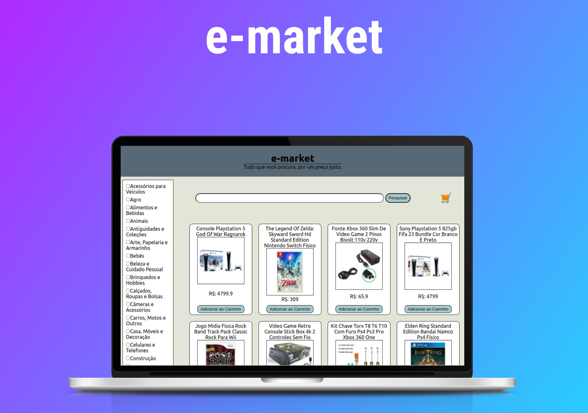

<h1 align="center"> Front End Store </h1>

Front End de uma loja online feito em ReactJs  
 
Em caso de dicas, observações ou ajuda você pode entrar em contato comigo por qualquer um dos meios disponibilazados na minha bio. 🙂❤️

  <a href="#-tecnologias">Tecnologias</a>&nbsp;&nbsp;&nbsp;|&nbsp;&nbsp;&nbsp;
  <a href="#-projeto">Projeto</a>

 

<!-- ⚠️ Projeto passando por algumas alterações de CSS, em breve disponibilizo as mudanças. ⚠️ -->

  

## 🚀 Tecnologias

Esse projeto foi desenvolvido utilizando as seguintes tecnologias:

- HTML e CSS
- JavaScript
- Git e Github
- ReatJs
- Trello

## 💻 Projeto

O Front End Store é o front end de uma loja online feito em grupo utilizando framework ReactJs como base.

<h2 align="center">Feito com ♥ by ogabrielfef</h2>